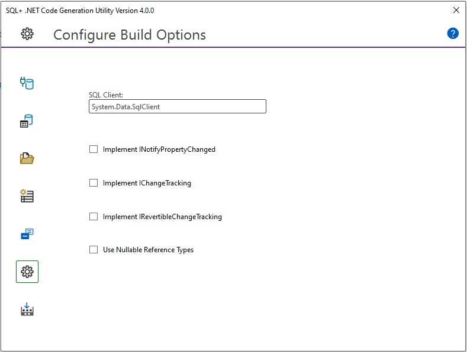

# Introduction

SQL+ is a natural evolution to the SQL programming language. By simply adding Semantic Tags to your SQL in the form of comments, you can build enterprise-worthy data services in minutes. Feature for feature, SQL+ is the best ORM for C# and SQL.

## 1. Write SQL
Consider the following SQL. Nothing out of the ordinary. Insert a customer, and set the @CustomerId parameter to the new identity. So what's missing? Well, quite a bit, but let's keep this example simple, and focus on validating the parameters. Can the parameters be null, what is the max string length, is the email a valid email? SQL+ can make your code better!

```sql
CREATE PROCEDURE [dbo].[CustomerInsert]
(
    @CustomerId int out,
    @LastName varchar(64),
    @FirstName varchar(64),
    @Email varchar(64)
)
AS
BEGIN

   INSERT INTO [dbo].[Customer]
    (
        [LastName],
        [FirstName],
        [Email]
    )
   VALUES
    (
        @LastName,
        @FirstName,
        @Email
    );

    SET @CustomerId = SCOPE_IDENTITY();

END;
```


## 2. Add Semantic Tags
With SQL+ you can enforce parameter validation by simply adding a few tags. In this example we add required tags, max length tags, and an email tag. The SQL+ Code generation utility will use this information to escalate the validation into the generated services. If you change the underlying SQL, just rerun the builder, and your code is perfectly synchronized. Long story short, you have a single source of truth that you can trust throughout the enterprise.

```sql
CREATE PROCEDURE [dbo].[CustomerInsert]
(
    @CustomerId int out,

    --+Required
    --+MaxLength=64      
    @LastName varchar(64),

    --+Required
    --+MaxLength=64
    @FirstName varchar(64),

    --+Required
    --+MaxLength=64
    --+Email
    @Email varchar(64)
)
AS
BEGIN

   INSERT INTO [dbo].[Customer]
    (
        [LastName],
        [FirstName],
        [Email]
    )
   VALUES
    (
        @LastName,
        @FirstName,
        @Email
    );

    SET @CustomerId = SCOPE_IDENTITY();

END;
```

## 3. Configure Build Options
With your Semantically Tagged SQL in place, you can choose build options that match your exact use case. If you want to implement a particular interface, check a box and you are done.


## 4. Generate Code
Just click build and let the tool do the work.


## 5. Enjoy
You've now built a service that includes all the validation you need, and you did it by simply adding a few tags to your SQL. Best part of all, your code will run four times faster than Entity Framework and twice as fast as Dapper.

```csharp
[TestMethod]
public void CustomerInsertTest()
{
    CustomerInsertInput input = new CustomerInsertInput
    {
        Email =  "sample@email.com",
        FirstName = "FirstName",
        LastName = "LastName",
    };

    if (input.IsValid())
    {
        CustomerInsertOutput output = service.CustomerInsert(input);
    }
    else
    {
        // TODO: Handle invalid input object

        foreach(var error in input.ValidationResults)
        {
           //.......
        }
    }
}
```

# Installation

Let's get you set up and ready to start generating some code. There are a few requirements before using these tools; you will need Visual Studio and SQL Server Management Studio. If you don't have these, you can get the [SQL Developer Edition](https://www.microsoft.com/en-us/sql-server/sql-server-downloads) and the [Visual Studio Community Edition](https://visualstudio.microsoft.com/vs/community/) for free from Microsoft.

## SSMS Snippets
You can utilize code snippets in SQL Server Management Studio to simplify adding the Semantic Tags when building database routines. To install the snippets <a id="snippets" href="CodeSnippits.zip">Download</a> and extract the snippets. After extraction, it's helpful to move the "+" folder to a convenient location.

### Code Snippets Download
After downloading and extracting, in SQL Server Management Studio click on **Tools**, **Code Snippets Manager**.


On the Code Snippets Manager dialog, click **Add**.


In the Code Snippets Directory dialog, navigate to the "+" folder you just extracted, and click **Select Folder**.


Click **OK** on the Code Snippets Manager Dialog to complete the installation.


With the code snippets in place, you can right click, choose **Insert Snippet**, select the + folder, and add the desired tags.

**Keyboard shortcut:** CTRL+K+X

## Visual Studio Code Snippets
You can utilize code snippets in Visual Studio to simplify adding the Semantic Tags when building ad-hoc queries. To install the snippets download and extract the snippets. After extraction, it's helpful to move the "+" folder to a convenient location.

### Code Snippets Download
After downloading and extracting, in Visual Studio click on **Tools**, **Code Snippets Manager**.


On the Code Snippets Manager dialog, set the language to Microsoft SQL Server Data Tools and click **Add**.


In the Code Snippets Directory dialog, navigate to the "+" folder you just extracted, and click **Select Folder**.


Click **OK** on the Code Snippets Manager Dialog to complete the installation.


With the code snippets in place, you can right-click, choose **Insert Snippet**, select the "+" folder, and add the desired tags.

**Keyboard shortcut:** CTRL+K+X

## Code Generator
The [Code Generation Utility](https://marketplace.visualstudio.com/items?itemName=AHHSoftware.V4) is available at the Visual Studio Market Place.

At the Visual Studio Marketplace click on the Download Button to get the SQL+ Code Generation Utility.


Navigate to the file you just downloaded and double click to launch the VSIX Installer, then click **Install**.


Let the installer do its thing. When finished click **Close**.

**Extension installation complete**

You are good to go!

# Routines or Queries

SQL+ will work with any database routine or ad-hoc SQL that you apply Semantic Tags to.

## Database Routines
When using database routines, add the semantic tags to the routine body. When you run the SQL+ code generation utility, it will display these routines in the UI. By default, these routines will use the schema name as the namespace. You can assign a namespace at the schema level and it will apply to all routines in that schema. Alternatively, you can assign individual routines to a schema if you need a more granular structure. SQL+ will create a folder structure based on the namespace assignments.

### Configuration Routines UI Illustration


The folder structure below reflects how those assignments are applied in the generated services.

### Configuration Routines Folder Illustration


## Ad-Hoc Queries
In SQL+, ad-hoc queries are .sql files that have been semantically tagged. Unlike routines, when using ad-hoc queries, it is the folder structure that dictates namespace assignments, where each subdirectory of the Queries folder becomes a namespace, and the name of the file is utilized for the name of the generated service.

### Ad-Hoc queries folder structure


In the UI, you can choose which files you want to include in the build. In this case we chose all files in Default, and Public folders (namespaces).

### Configuration Queries UI Illustration


The folder structure below reflects how the Queries folder structure is utilized in the generated services.

### Configuration Routines Folder Illustration


## Which is Better?
The real question that needs to be asked is which is better for you?

If performance is your thing, stored procedures are the way to go. If you like self-contained services that are easier to deploy, ad-hoc queries are a better choice.

You should discuss this with your team, and come up with a strategy that suits the way you work.

# Semantic Tags
*Last updated: 3/6/2024*

Semantic Tags are the key ingredient in SQL+ and provide the means to fine-tune every aspect of your generated code. Use this guide to gain valuable insight into how each tag performs.

## SQL+ Routine Tag
The routine tag is the only tag that is required and is placed at the beginning of a stored procedure or ad-hoc query. This tag signals to the builder that the routine is available for code generation. This tag also defines the select type, accepts a comment and author name, and has the option of changing the timeout to something other than the default. Each part of this tag is covered in detail below.

```sql
--+SqlPlusRoutine
    --&SelectType=NonQuery or SingleRow or MultiRow or JSON or XML or MultiSet
    --&Comment=Comment
    --&Author=Author
    --&CommandTimeout=seconds
--+SqlPlusRoutine
```

*Note that the command timeout is optional.*

- **SelectType:**
  - NonQuery: The output of the call will not contain a result set.
  - SingleRow: The procedure executes a SELECT that will return a maximum of one row.
  - MultiRow: The procedure executes a SELECT statement that will return an undetermined number of rows.
  - JSON: The procedure executes a SELECT … FOR JSON PATH.
  - MultiSet: Use this in combination with Query tags for services that return multiple result sets.
  - XML: The procedure executes a SELECT … FOR XML.
- **Comment:** Provides a comment for your service.
- **Author:** The creator of the SQL routine.
- **CommandTimeout:** Used to override the default timeout for commands.

## SQL+ Parameter Validation Tags
Parameter validation tags are applied to parameters in stored procedures or variables in ad-hoc queries. The following parameter validation tags are available:

```sql
--+CreditCard
--+Email
--+MaxLength=MaximumLength
--+MinLength=MinimumLength
--+Phone
--+PostalCode
--+Range=MinimumValue,MaximumValue
--+RegExPattern=RegularExpression
--+Required
--+StringLength=MinimumLength,MaximumLength
--+Url
```

*Note that the use of these tags is optional.*

- **CreditCard:** Enforces credit card validation.
- **Email:** Enforces email validation.
- **MaxLength:** Enforces max length validation.
- **MinLength:** Enforces min length validation.
- **Phone:** Enforces liberal phone validation.
- **PostalCode:** Enforces liberal postal code validation.
- **Range:** Enforces range validation.
- **RegExPattern:** Enforces regex validation.
- **Required:** Enforces required (non-nullable) validation.
- **StringLength:** Enforces min and max lengths for a string.
- **Url:** Enforces the format to be a fully qualified URL.

## Validation Tag Supplemental Values
An additional feature available when applying validation tags is the ability to customize error messages.

```sql
--+CreditCard
--&ErrorMessage=ErrorMessage

--+CreditCard
--&ErrorResource=ResourceType,ResourceName
```

- **Error Message:** Provides a custom error message.
- **Error Resource:** Provides a custom error message residing in a resource file.

## SQL+ Parameter Display Tags
Parameter display tags are applied to parameters in stored procedures or variables in ad-hoc queries.

```sql
--+Comment=Comment
--+Display=Name,Description
```

*Note that the use of these tags is optional.*

- **Comment:** Creates a comment for the generated property.
- **Display:**
  - **Name:** The value to be displayed.
  - **Description:** This value is not currently used.

## Display Tag Supplemental Values
An additional feature available when applying the display tag is the ability to link to resource files.

```sql
--&Resource=ResourceType
```

- **ResourceType:** Specifies the resource file to use in tandem with the display property.

## SQL+ Parameter Direction (Mode) Tags
Stored Procedures:

```sql
--+InOut
```

- **InOut:** The parameter is available in both directions.

Ad-Hoc Queries:

```sql
--+InOut
--+Output
```

- **InOut:** Makes the parameter an in/out parameter.
- **Output:** Makes the parameter exclusively an out parameter.

## SQL+ Return Value Tags
The return tag is used to enumerate return values.

```sql
--+Return=EnumeratedValue,Description
```

- **EnumeratedValue:** Specifies the return value.
- **Description:** Describes the return value.

## SQL+ Multiple Result Query Tags
When procedures or ad-hoc queries return multiple result sets, each query is wrapped with query tags.

```sql
--+QueryStart=Name,SelectType
--+QueryEnd
```

- **Name:** Specifies the name of the result object.
- **SelectType:** Specifies the select type.

# Static Data

Quite often it’s the case where certain database tables contain data that rarely, if ever changes. A customer type table would be a good example. This type of data is a candidate for creating a static version.

SQL+ offers two different approaches to building static data. You can generate lists of data, or enumerations.

## Static Lists
The table column structure of the query will be represented as properties in a class definition. Each row in the query creates an item in a list of static data, based on the same class definition.

### Generate static lists sample data


### Generate static lists configuration


The result would be the following. Comments have been removed for the purpose of this example.

### Static list generation output


## Enumerations
Enumerations work much the same way as static lists, however, the queries for enumerations must adhere to a particular format as follows:

- **Name:** Alias the column that represents the string constant value as `[Name]`.
- **Value:** Alias the column that represents the numeric constant value as `[Value]`.
- **Comment:** Alias the column that represents a comment as `[Comment]` (optional).

Again with the following data in the CustomerType table:

### Generate enumerations sample data


### Generate enumerations lists configuration


The result would be the following:


# Code Generation

With your SQL enhanced with the SQL+ Semantic Tags, it's time to put the SQL+ Code Generation Utility to work.

1. **Launch the Builder**
   Right click your project and choose the menu option "SQL+ Builder" to launch the SQL+ Code Generation Utility.

   

2. **Configure Database Connection**
   Enter your database type and connection string for the database that hosts the objects you intend to build.

   

   Once you have filled in these values, click connect to load the build objects into the UI.

3. **Configure Database Routines**
   After connecting to the database, any database routines that include the SQL+ Routine tag will be displayed in the Configure Database Routines area.

   

   Once you have cleared any errors, use the text inputs to assign your routines to a namespace.

4. **Configure Ad-Hoc Queries**
   If you have any ad-hoc queries in your project, they will be displayed here.

   

   Once you have cleared any errors, select the queries you wish to include in the build.

5. **Configure Static Lists**
   Class definitions, as well as populated lists of static data will be created for each query defined in the builder.

   

   Once you have cleared any errors you are ready to move onto the queries for enumerations.

6. **Configure Enumerations**
   Enumeration definitions will be created for each query defined in the builder.

   

   Once you have cleared any errors you are ready to move on to build options.

7. **Configure Build Options**
   Choose any of the build options you want to utilize for your generated services.

   

   Once you are satisfied with your build options, you can proceed to the build area.

8. **Run The Builder**
   Once you are satisfied with all your build objects, and have made your build option choices, you can simply run the builder. In the Build Project area, click the Build Project button.


